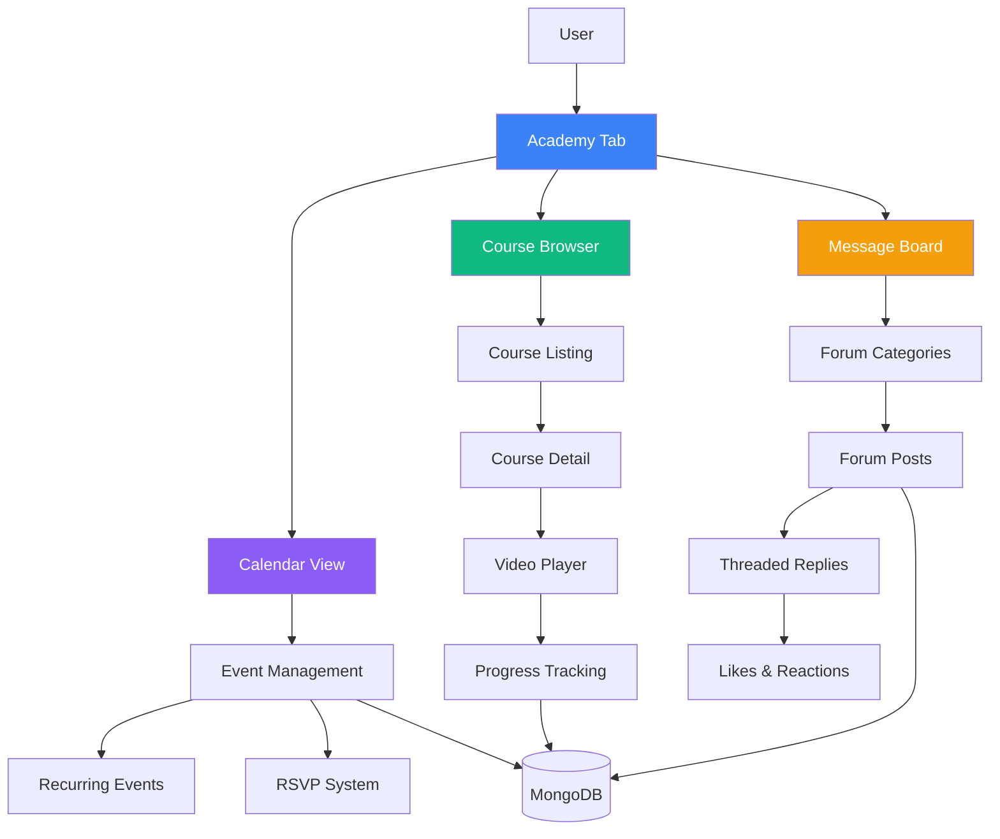
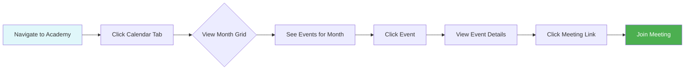
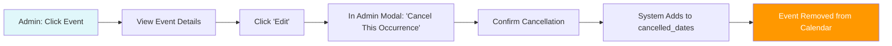
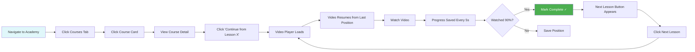
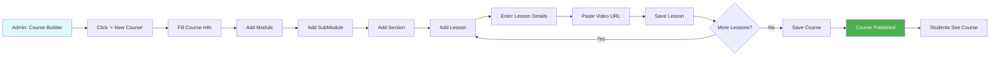
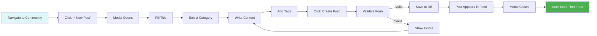
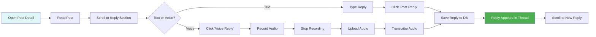
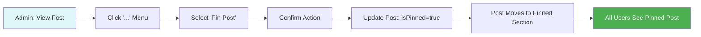
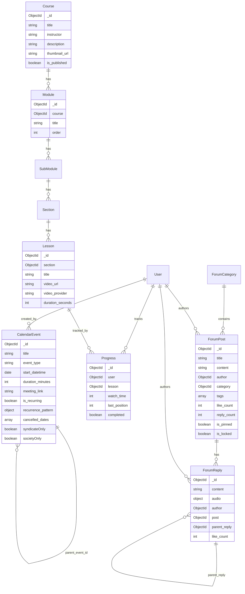

# LMS System - UI Functionality PRD

> **Product Requirements Document**: Complete specification of the Learning Management System (LMS) functionality, including Calendar, Courses, and Message Board (Community Forum).

---

## Table of Contents

1. [Executive Summary](#executive-summary)
2. [System Overview](#system-overview)
3. [Calendar System](#calendar-system)
4. [Course System](#course-system)
5. [Message Board (Community Forum)](#message-board-community-forum)
6. [User Roles & Permissions](#user-roles--permissions)
7. [Data Models](#data-models)
8. [API Endpoints](#api-endpoints)
9. [UI Components](#ui-components)
10. [User Flows](#user-flows)
11. [Success Metrics](#success-metrics)

---

## Executive Summary

### Purpose

The LMS system provides an integrated learning platform within the application, combining:
- **Calendar**: Event scheduling, recurring meetings, office hours
- **Courses**: Structured video-based learning with progress tracking
- **Message Board**: Community discussions, Q&A, and peer collaboration

### Goals

1. **Replace external dependencies** (Skool.com, external LMS platforms)
2. **Keep users engaged** within a single ecosystem
3. **Track learning progress** automatically
4. **Foster community** through threaded discussions
5. **Streamline administration** with intuitive content management

### Target Users

- **Students**: Access courses, track progress, participate in community
- **Instructors/Admins**: Create courses, manage calendar, moderate forums
- **Free/Paid Tiers**: Differentiated access based on membership level

---

## System Overview

### Architecture Diagram



### Technology Stack

**Current Implementation:**
- **Frontend**: React + TypeScript, Recoil state management
- **Backend**: Node.js + Express, MongoDB + Mongoose
- **Video**: YouTube/Vimeo embed players
- **Real-time**: Socket.io for forum updates

**Rebuild Target:**
- **Frontend**: Vite + React + TanStack Router + MobX
- **Backend**: Hono + Cloudflare Workers
- **Database**: Neon Postgres + Drizzle ORM
- **Video**: Custom player + Cloudflare Stream (optional)
- **Real-time**: Cloudflare Durable Objects + WebSockets

---

## Calendar System

### Overview

The Calendar system manages events, meetings, office hours, and workshops with support for:
- One-time and recurring events
- Tier-based access control (Syndicate-only, Society-only)
- Meeting integrations (Zoom, Google Meet)
- RSVP tracking
- Admin-only event creation

### User Interface

#### 1. Calendar View (Month Grid)

**Layout:**

```
┌────────────────────────────────────────────────────────────┐
│  [←] December 2024 [→]    [Today]         [+ Add Event]   │ ← Header
├────────────────────────────────────────────────────────────┤
│  Sun    Mon    Tue    Wed    Thu    Fri    Sat            │
├────────────────────────────────────────────────────────────┤
│   1      2      3      4      5      6      7              │
│                                [📅 OH]                     │ ← Office Hours
│                                 10am                        │
├────────────────────────────────────────────────────────────┤
│   8      9     10     11     12     13     14              │
│        [👥]                         [🎓]  [👥]            │ ← Community Call, Workshop
│         2pm                          6pm   10am            │
├────────────────────────────────────────────────────────────┤
│  15     16     17     18     19     20     21              │
│                              [📅]                          │
│                               10am                          │
└────────────────────────────────────────────────────────────┘
```

**Features:**
- ✅ **Month navigation**: Previous/next month, jump to today
- ✅ **Event indicators**: Color-coded by event type
- ✅ **Click to view details**: Event modal with full info
- ✅ **Admin: Click date to create**: Quick event creation
- ✅ **Responsive**: Adapts to mobile (list view)

**Event Type Color Coding:**

| Event Type | Color | Icon | Description |
|------------|-------|------|-------------|
| Office Hours | Blue | 🕐 | Weekly Q&A with instructor |
| Community Call | Green | 👥 | Group discussion/networking |
| Workshop | Purple | 🎓 | Interactive learning session |
| Coaching | Orange | 💬 | 1:1 or group coaching |

#### 2. Event Details Modal (User View)

**User clicks on event → Event details modal appears**

```
┌─────────────────────────────────────────────┐
│  Office Hours with James          [✕]      │
│  ─────────────────────────────────────────  │
│                                             │
│  📅 Thursday, Dec 5, 2024                  │
│  🕐 10:00 AM - 11:00 AM (PST)              │
│  ⏱️ 60 minutes                             │
│                                             │
│  📝 Description:                           │
│  Weekly office hours for Q&A and coaching  │
│  Bring your questions and challenges!      │
│                                             │
│  🔗 Meeting Link:                          │
│  [Join Zoom Meeting]                       │
│                                             │
│  🔁 Recurring: Every Thursday at 10am      │
│  👥 Open to: Syndicate & Society members   │
│                                             │
│  [Close]           [Add to Calendar ↓]    │ ← Export to Google Cal
└─────────────────────────────────────────────┘
```

**Elements:**
- ✅ Event title and type icon
- ✅ Date, time, timezone, duration
- ✅ Description (markdown supported)
- ✅ Meeting link (clickable)
- ✅ Recurrence pattern (if recurring)
- ✅ Access restrictions (tier badges)
- ✅ Export to personal calendar (.ics download)

#### 3. Admin Event Modal (Create/Edit)

**Admin clicks "+ Add Event" or edits existing event**

```
┌─────────────────────────────────────────────┐
│  Create Event                     [✕]      │
│  ─────────────────────────────────────────  │
│                                             │
│  Event Type:  [Office Hours    ▼]         │
│  Title:       [Office Hours with James   ] │
│  Description: [Weekly Q&A session...     ] │
│               [                           ] │
│                                             │
│  📅 Date & Time:                           │
│  Date:        [12/05/2024]                 │
│  Start:       [10:00 AM] [PST ▼]          │
│  Duration:    [60] minutes                 │
│                                             │
│  🔁 Recurring:  [✓] Yes                    │
│     Frequency:  [Weekly ▼]                 │
│     Repeat on:  [✓ Thu]                   │
│     End:        [○ Never  ○ After  ● Date]│
│                 [12/31/2024]               │
│                                             │
│  🔗 Meeting:                               │
│  Provider:    [Zoom ▼]                     │
│  Link:        [https://zoom.us/j/...     ] │
│                                             │
│  👥 Access:                                │
│     [✓] Syndicate Only                     │
│     [ ] Society Only                       │
│                                             │
│  [Cancel]              [Save Event]        │
└─────────────────────────────────────────────┘
```

**Features:**
- ✅ **Event type selector** (office_hours, community_call, workshop, coaching)
- ✅ **Title & description** (markdown editor)
- ✅ **Date/time picker** with timezone
- ✅ **Duration selector** (15, 30, 45, 60, 90 minutes)
- ✅ **Recurring event setup**:
  - Frequency: daily, weekly, biweekly, monthly
  - Days of week (for weekly/biweekly)
  - End condition: never, after X occurrences, by date
- ✅ **Meeting integration**:
  - Provider: Zoom, Google Meet, custom link
  - Auto-generate meeting link (if integrated)
- ✅ **Tier restrictions**: Syndicate-only, Society-only, or all tiers
- ✅ **Validation**: Required fields, no overlapping events

### User Flows

#### Flow 1: User Views Calendar



#### Flow 2: Admin Creates Recurring Event

```mermaid
graph LR
    A[Admin: Calendar View] --> B[Click '+ Add Event']
    B --> C[Fill Event Form]
    C --> D[Check 'Recurring']
    D --> E[Set Frequency: Weekly]
    E --> F[Select Days: Thu]
    F --> G[Set End: Never]
    G --> H[Save Event]
    H --> I[System Generates Occurrences]
    I --> J[Events Appear on Calendar]
    
    style A fill:#e0f7fa
    style J fill:#4caf50,color:#fff
```



#### Flow 3: Admin Cancels Single Occurrence



### Data Model

**CalendarEvent Schema:**

```typescript
interface CalendarEvent {
  _id: ObjectId;
  
  // Basic info
  title: string;                    // "Office Hours with James"
  description: string;              // Markdown description
  event_type: EventType;            // office_hours | community_call | workshop | coaching
  
  // Timing
  start_datetime: Date;             // ISO 8601 datetime
  duration_minutes: number;         // 60
  timezone: string;                 // "America/Los_Angeles"
  
  // Meeting
  meeting_link: string;             // "https://zoom.us/j/123456"
  meeting_provider: MeetingProvider; // zoom | google_meet | solo_meeting | custom | none
  meeting_settings: {
    allowVideo: boolean;
    allowAudio: boolean;
    autoRecord: boolean;
    waitingRoom: boolean;
  };
  
  // Recurrence
  is_recurring: boolean;
  recurrence_pattern?: {
    frequency: 'daily' | 'weekly' | 'biweekly' | 'monthly';
    interval: number;               // 1 = every week, 2 = every 2 weeks
    days_of_week: number[];         // [4] = Thursday (0=Sun, 6=Sat)
    end_type: 'never' | 'after_occurrences' | 'by_date';
    occurrences?: number;           // If end_type = after_occurrences
    end_date?: Date;                // If end_type = by_date
  };
  cancelled_dates: string[];        // ["2024-12-19"] = skip this occurrence
  parent_event_id?: ObjectId;       // For single occurrence of recurring event
  is_occurrence: boolean;           // True if generated from recurring parent
  
  // Access control
  syndicateOnly: boolean;           // Only Syndicate tier can see
  societyOnly: boolean;             // Only Society tier can see
  
  // Metadata
  created_by_admin_id: ObjectId;
  is_active: boolean;
  deleted_at?: Date;
  created_at: Date;
  updated_at: Date;
}

type EventType = 'office_hours' | 'community_call' | 'workshop' | 'coaching';
type MeetingProvider = 'zoom' | 'google_meet' | 'solo_meeting' | 'custom' | 'none';
```

**Key Indexes:**
- `start_datetime + is_active` (for date range queries)
- `parent_event_id` (for recurring event lookups)
- `event_type` (for filtering by type)
- `syndicateOnly + societyOnly` (for tier filtering)

### API Endpoints

#### Get Events for Month

```http
GET /api/lms/calendar/events?year=2024&month=12
Authorization: Bearer <token>
```

**Response:**
```json
{
  "success": true,
  "events": [
    {
      "_id": "event123",
      "title": "Office Hours with James",
      "event_type": "office_hours",
      "start_datetime": "2024-12-05T18:00:00Z",
      "duration_minutes": 60,
      "meeting_link": "https://zoom.us/j/123",
      "is_recurring": true,
      "syndicateOnly": true
    }
  ]
}
```

**Server-side Logic:**
1. Parse `year` and `month` from query params
2. Calculate date range (start of month to end of month)
3. Query `CalendarEvent` for events in range
4. For recurring events: generate occurrences dynamically
5. Filter by user's tier (if `syndicateOnly` or `societyOnly`)
6. Return events sorted by `start_datetime`

#### Create Event (Admin Only)

```http
POST /api/lms/calendar/events
Authorization: Bearer <admin-token>
Content-Type: application/json

{
  "title": "Office Hours",
  "description": "Weekly Q&A",
  "event_type": "office_hours",
  "start_datetime": "2024-12-05T18:00:00Z",
  "duration_minutes": 60,
  "timezone": "America/Los_Angeles",
  "meeting_link": "https://zoom.us/j/123",
  "meeting_provider": "zoom",
  "is_recurring": true,
  "recurrence_pattern": {
    "frequency": "weekly",
    "interval": 1,
    "days_of_week": [4],
    "end_type": "never"
  },
  "syndicateOnly": true
}
```

**Response:**
```json
{
  "success": true,
  "event": { /* created event */ }
}
```

#### Update Event (Admin Only)

```http
PUT /api/lms/calendar/events/:eventId
Authorization: Bearer <admin-token>
Content-Type: application/json

{
  "title": "Updated Office Hours",
  "meeting_link": "https://newzoom.link"
}
```

#### Cancel Single Occurrence (Admin Only)

```http
POST /api/lms/calendar/events/:eventId/cancel-occurrence
Authorization: Bearer <admin-token>
Content-Type: application/json

{
  "occurrence_date": "2024-12-19"  // YYYY-MM-DD
}
```

**Server Action:**
- Add `"2024-12-19"` to parent event's `cancelled_dates` array
- Future queries skip this date when generating occurrences

#### Delete Event (Admin Only)

```http
DELETE /api/lms/calendar/events/:eventId
Authorization: Bearer <admin-token>
```

**Server Action:**
- Soft delete: set `deleted_at = now()`
- Or hard delete: remove from database

---

## Course System

### Overview

The Course system provides structured video-based learning with:
- Hierarchical content (Course → Module → SubModule → Section → Lesson)
- Video player with progress tracking
- Automatic resume from last position
- Completion tracking (90% watched = complete)
- Tier-based access control
- Admin content management

### Content Hierarchy

```
Course
 ├─ Module 1
 │   ├─ SubModule 1.1
 │   │   ├─ Section 1.1.1
 │   │   │   ├─ Lesson 1.1.1.1
 │   │   │   └─ Lesson 1.1.1.2
 │   │   └─ Section 1.1.2
 │   └─ SubModule 1.2
 └─ Module 2
```

**Example Structure:**
- **Course**: "Marketing Mastery"
  - **Module**: "Foundation"
    - **SubModule**: "Understanding Your Audience"
      - **Section**: "Demographics & Psychographics"
        - **Lesson**: "Who is Your Ideal Customer?"
        - **Lesson**: "Creating Customer Personas"

### User Interface

#### 1. Course Browser (Landing)

**Layout:**

```
┌────────────────────────────────────────────────────────────┐
│  Academy > Courses                                         │
│  ─────────────────────────────────────────────────────────  │
│                                                             │
│  [All] [In Progress] [Completed]          [Search...]     │ ← Filters
│                                                             │
│  ┌──────────────┐  ┌──────────────┐  ┌──────────────┐    │
│  │  [Thumbnail] │  │  [Thumbnail] │  │  [Thumbnail] │    │
│  │              │  │              │  │              │    │
│  │  Marketing   │  │  Sales       │  │  Product     │    │
│  │  Mastery     │  │  Funnel      │  │  Launch      │    │
│  │              │  │              │  │              │    │
│  │  James Kemp  │  │  Sarah Lee   │  │  Mike Chen   │    │
│  │  ████░░░░░░  │  │  ██░░░░░░░░  │  │  ██████████  │    │
│  │  40% complete│  │  20% complete│  │  100% ✓      │    │
│  │              │  │              │  │              │    │
│  │  8 modules   │  │  12 modules  │  │  6 modules   │    │
│  │  [Continue]  │  │  [Continue]  │  │  [Review]    │    │
│  └──────────────┘  └──────────────┘  └──────────────┘    │
└────────────────────────────────────────────────────────────┘
```

**Features:**
- ✅ **Filter tabs**: All courses, In Progress, Completed
- ✅ **Search**: Find courses by name
- ✅ **Course cards** with:
  - Thumbnail image
  - Course title
  - Instructor name
  - Progress bar (% complete)
  - Module count
  - CTA button (Continue/Start/Review)
- ✅ **Responsive grid**: 3 columns desktop, 1 column mobile

#### 2. Course Detail Page

**Layout:**

```
┌────────────────────────────────────────────────────────────┐
│  [←] Marketing Mastery                                     │
│  ──────────────────────────────────────────────────────────  │
│                                                             │
│  ┌──────────────────────────────────────────────────────┐  │
│  │         [Course Banner/Thumbnail Image]              │  │
│  └──────────────────────────────────────────────────────┘  │
│                                                             │
│  Marketing Mastery                                          │
│  by James Kemp                                             │
│                                                             │
│  Master the art of digital marketing and grow your         │
│  business with proven strategies and frameworks.           │
│                                                             │
│  📊 Progress: ████░░░░░░ 40%                               │
│  📚 8 Modules • 42 Lessons • 12 hours                      │
│                                                             │
│  [Start Course] or [Continue from Lesson 12]              │
│                                                             │
├────────────┬────────────────────────────────────────────────┤
│            │                                                │
│ Modules    │  Module 1: Foundation                ▼       │ ← Expandable
│            │  ✓ SubModule 1.1: Getting Started            │
│ ▼ Module 1 │    ✓ Section 1.1.1: Introduction            │
│ ▽ Module 2 │      • Lesson 1: Welcome (5:32) ✓           │
│ ▷ Module 3 │      • Lesson 2: Course Overview (8:15) ✓   │
│            │    ▶ Section 1.1.2: Setup                    │
│            │  ▶ SubModule 1.2: Core Concepts              │
│            │                                                │
│            │  Module 2: Strategy                  ►       │
│            │                                                │
└────────────┴────────────────────────────────────────────────┘
```

**Features:**
- ✅ **Back button**: Return to course browser
- ✅ **Course banner**: Visual hero image
- ✅ **Course metadata**:
  - Title, instructor
  - Description (markdown)
  - Overall progress bar
  - Total modules, lessons, duration
- ✅ **CTA button**:
  - "Start Course" (if no progress)
  - "Continue from Lesson X" (if in progress)
  - "Review Course" (if completed)
- ✅ **Collapsible module tree**:
  - Expand/collapse modules, submodules, sections
  - Checkmarks (✓) for completed lessons
  - Click lesson to navigate to video player

#### 3. Lesson Viewer (Video Player)

**Layout:**

```
┌────────────────────────────────────────────────────────────┐
│  [←] Marketing Mastery > Module 1 > Lesson 2               │
│  ──────────────────────────────────────────────────────────  │
│                                                             │
│  ┌──────────────────────────────────────────────────────┐  │
│  │                                                       │  │
│  │         [Video Player]                                │  │ ← YouTube/Vimeo/Custom
│  │         [▶️ Play]                                     │  │
│  │                                                       │  │
│  │         [■■■■■■■■■■────] 8:32 / 15:00                │  │
│  │         [⏮️ -10s] [▶️/⏸️] [⏭️ +10s] [🔊] [⚙️] [⛶]    │  │
│  └──────────────────────────────────────────────────────┘  │
│                                                             │
│  Lesson 2: Course Overview                                  │
│  In this lesson, we'll cover the key concepts...           │
│                                                             │
│  ──────────────────────────────────────────────────────────  │
│                                                             │
│  📝 Transcript:                                            │
│  [00:00] Welcome to the course overview...                 │
│  [00:15] In this lesson, we'll discuss...                  │
│  [00:32] First, let's talk about...                        │
│                                                             │
│  ──────────────────────────────────────────────────────────  │
│                                                             │
│  [← Previous Lesson]                    [Next Lesson →]   │
│                                                             │
└────────────────────────────────────────────────────────────┘
```

**Features:**
- ✅ **Breadcrumb navigation**: Course > Module > Lesson
- ✅ **Video player**:
  - YouTube, Vimeo, or custom HTML5 player
  - Auto-resume from last position
  - Progress bar with scrubbing
  - Playback controls (play/pause, skip ±10s, volume, settings, fullscreen)
  - Playback speed (0.5x, 1x, 1.25x, 1.5x, 2x)
  - Quality selector (if available)
- ✅ **Progress tracking**:
  - Save position every 5 seconds (debounced)
  - Mark complete at 90% watched
  - Visual indicator (checkmark) on completion
- ✅ **Lesson metadata**:
  - Lesson title
  - Description (markdown)
  - Duration
- ✅ **Transcript** (optional):
  - Timestamped text
  - Clickable timestamps (jump to position)
  - Searchable
- ✅ **Navigation**:
  - Previous/Next lesson buttons
  - Jump back to course detail view

#### 4. Admin Course Builder

**Admin can create/edit courses via separate admin interface**

```
┌────────────────────────────────────────────────────────────┐
│  Admin > Course Builder                                    │
│  ──────────────────────────────────────────────────────────  │
│                                                             │
│  Course: [Marketing Mastery                             ]  │
│  Instructor: [James Kemp                                ]  │
│  Description: [Master the art of...                     ]  │
│               [                                          ]  │
│                                                             │
│  Thumbnail: [Upload Image] or [URL: https://...         ]  │
│                                                             │
│  ──────────────────────────────────────────────────────────  │
│                                                             │
│  Modules:                                                   │
│  ┌──────────────────────────────────────────────────────┐  │
│  │ Module 1: Foundation                 [↑] [↓] [✕]    │  │
│  │   Order: [1]  Title: [Foundation              ]     │  │
│  │                                                       │  │
│  │   SubModules:                                         │  │
│  │   ┌─────────────────────────────────────────────┐    │  │
│  │   │ SubModule 1.1: Getting Started  [↑] [↓] [✕]│    │  │
│  │   │   Sections:                                  │    │  │
│  │   │   ┌─────────────────────────────────────┐   │    │  │
│  │   │   │ Section 1.1.1: Intro    [↑] [↓] [✕]│   │    │  │
│  │   │   │   Lessons:                           │   │    │  │
│  │   │   │   • Lesson 1: Welcome [Edit] [✕]   │   │    │  │
│  │   │   │   • Lesson 2: Overview [Edit] [✕]  │   │    │  │
│  │   │   │   [+ Add Lesson]                     │   │    │  │
│  │   │   └─────────────────────────────────────┘   │    │  │
│  │   │   [+ Add Section]                            │    │  │
│  │   └─────────────────────────────────────────────┘    │  │
│  │   [+ Add SubModule]                                   │  │
│  └──────────────────────────────────────────────────────┘  │
│  [+ Add Module]                                             │
│                                                             │
│  [Cancel]                          [Save Course]           │
└────────────────────────────────────────────────────────────┘
```

**Features:**
- ✅ **CRUD operations**: Create, read, update, delete courses
- ✅ **Nested structure**: Modules → SubModules → Sections → Lessons
- ✅ **Drag to reorder**: Change order of modules/lessons
- ✅ **Lesson editor**:
  - Title, description
  - Video URL (YouTube, Vimeo, or direct link)
  - Video provider selector
  - Duration (auto-detect or manual)
  - Transcript upload (optional)
- ✅ **Validation**: Required fields, valid URLs
- ✅ **Preview mode**: View course as student before publishing

### User Flows

#### Flow 1: Student Watches Lesson



#### Flow 2: Admin Creates Course



### Data Models

#### Course Schema

```typescript
interface Course {
  _id: ObjectId;
  title: string;                    // "Marketing Mastery"
  description: string;              // Markdown description
  instructor: string;               // "James Kemp"
  thumbnail_url: string;            // Banner image
  is_published: boolean;            // Published or draft
  tier_restriction?: TierLevel;     // free | syndicate | society
  order: number;                    // Display order
  created_by: ObjectId;             // Admin who created
  created_at: Date;
  updated_at: Date;
}
```

#### Module Schema

```typescript
interface Module {
  _id: ObjectId;
  course: ObjectId;                 // Parent course
  title: string;                    // "Foundation"
  description?: string;
  order: number;                    // Display order within course
  created_at: Date;
  updated_at: Date;
}
```

#### SubModule Schema

```typescript
interface SubModule {
  _id: ObjectId;
  module: ObjectId;                 // Parent module
  title: string;                    // "Getting Started"
  description?: string;
  order: number;                    // Display order within module
  created_at: Date;
  updated_at: Date;
}
```

#### Section Schema

```typescript
interface Section {
  _id: ObjectId;
  submodule: ObjectId;              // Parent submodule
  title: string;                    // "Introduction"
  order: number;                    // Display order within submodule
  created_at: Date;
  updated_at: Date;
}
```

#### Lesson Schema

```typescript
interface Lesson {
  _id: ObjectId;
  section: ObjectId;                // Parent section
  module: ObjectId;                 // Direct link for querying
  title: string;                    // "Welcome to the Course"
  description?: string;             // Markdown
  video_url: string;                // "https://youtube.com/watch?v=..."
  video_provider: VideoProvider;    // youtube | vimeo | custom
  duration_seconds: number;         // 315 (5:15)
  transcript?: string;              // Optional timestamped transcript
  order: number;                    // Display order within section
  created_at: Date;
  updated_at: Date;
}

type VideoProvider = 'youtube' | 'vimeo' | 'custom';
```

#### Progress Schema

```typescript
interface Progress {
  _id: ObjectId;
  user: ObjectId;                   // Student ID
  course: ObjectId;                 // Course ID
  module: ObjectId;                 // Module ID
  lesson: ObjectId;                 // Lesson ID
  
  // Progress tracking
  watch_time: number;               // Total seconds watched
  last_position: number;            // Last video position (seconds)
  completed: boolean;               // Marked complete at 90%
  completed_at?: Date;              // Timestamp of completion
  
  last_accessed_at: Date;           // Last time user viewed this lesson
  created_at: Date;
  updated_at: Date;
}
```

**Unique Constraint:** `user + lesson` (one progress record per user-lesson pair)

**Key Indexes:**
- `user + course + completed` (for course progress queries)
- `user + lesson` (for fetching individual lesson progress)
- `last_accessed_at` (for "continue where you left off")

### API Endpoints

#### Get All Courses

```http
GET /api/lms/courses
Authorization: Bearer <token>
```

**Response:**
```json
{
  "success": true,
  "courses": [
    {
      "_id": "course123",
      "title": "Marketing Mastery",
      "instructor": "James Kemp",
      "thumbnail_url": "https://cdn.com/thumb.jpg",
      "description": "Master marketing...",
      "progress": {
        "percent_complete": 40,
        "lessons_completed": 12,
        "total_lessons": 42
      }
    }
  ]
}
```

**Server Logic:**
1. Fetch all published courses
2. For each course, calculate user's progress:
   - Count completed lessons
   - Total lessons in course
   - Percent complete = (completed / total) * 100
3. Filter by tier restriction (if any)
4. Return courses with progress

#### Get Course Detail

```http
GET /api/lms/courses/:courseId
Authorization: Bearer <token>
```

**Response:**
```json
{
  "success": true,
  "course": {
    "_id": "course123",
    "title": "Marketing Mastery",
    "instructor": "James Kemp",
    "description": "Master marketing...",
    "modules": [
      {
        "_id": "module1",
        "title": "Foundation",
        "order": 1,
        "submodules": [
          {
            "_id": "submodule1",
            "title": "Getting Started",
            "order": 1,
            "sections": [
              {
                "_id": "section1",
                "title": "Introduction",
                "order": 1,
                "lessons": [
                  {
                    "_id": "lesson1",
                    "title": "Welcome",
                    "duration_seconds": 332,
                    "completed": true
                  }
                ]
              }
            ]
          }
        ]
      }
    ]
  }
}
```

**Server Logic:**
1. Fetch course by ID
2. Populate nested structure (modules → submodules → sections → lessons)
3. For each lesson, check if user has completed it
4. Return full course tree with progress indicators

#### Get Lesson Detail

```http
GET /api/lms/lessons/:lessonId
Authorization: Bearer <token>
```

**Response:**
```json
{
  "success": true,
  "lesson": {
    "_id": "lesson1",
    "title": "Welcome to the Course",
    "description": "In this lesson...",
    "video_url": "https://youtube.com/watch?v=abc123",
    "video_provider": "youtube",
    "duration_seconds": 332,
    "transcript": "[00:00] Welcome...",
    "progress": {
      "last_position": 145,
      "completed": false
    }
  },
  "navigation": {
    "previous_lesson_id": null,
    "next_lesson_id": "lesson2"
  }
}
```

#### Update Lesson Progress

```http
PUT /api/lms/progress/:lessonId
Authorization: Bearer <token>
Content-Type: application/json

{
  "last_position": 150,
  "watch_time": 150,
  "duration": 332
}
```

**Server Logic:**
1. Find or create Progress record for user + lesson
2. Update `last_position` to new value
3. Update `watch_time` (only if greater than current)
4. Check if `last_position >= duration * 0.9`:
   - If yes: set `completed = true`, `completed_at = now()`
5. Update `last_accessed_at = now()`
6. Save progress
7. Return updated progress

**Client Behavior:**
- Debounced: Send update every 5 seconds while video playing
- Send final update on:
  - Video paused
  - User navigates away
  - Component unmounts

---

## Message Board (Community Forum)

### Overview

The Message Board (Community Forum) provides threaded discussions with:
- Category-based organization
- Posts with replies (nested threading)
- Likes and reactions
- Pinned posts (admins)
- Locked posts (admins)
- Soft delete (admin moderation)
- Edit history tracking
- Search functionality
- Voice message support (audio replies)

### User Interface

#### 1. Forum Landing (Category View)

**Layout:**

```
┌────────────────────────────────────────────────────────────┐
│  Academy > Community                                       │
│  ──────────────────────────────────────────────────────────  │
│                                                             │
│  [Filter: All ▼]                       [Search posts...]  │
│                                                             │
│  [+ New Post]                                              │
│                                                             │
│  ──────────────────────────────────────────────────────────  │
│  📌 PINNED                                                  │
│  ──────────────────────────────────────────────────────────  │
│                                                             │
│  [👤] Welcome to the Community!                            │
│       Posted by Admin • 2 days ago • General               │
│       👍 24  💬 12                              [→]        │
│                                                             │
│  ──────────────────────────────────────────────────────────  │
│                                                             │
│  [👤] How do I implement rate limiting?                    │
│       Posted by Alice • 3 hours ago • Development          │
│       "I'm trying to add rate limiting to my Express..."   │
│       👍 5  💬 8                               [→]         │
│                                                             │
│  [👤] Best marketing automation tools?                     │
│       Posted by Bob • 5 hours ago • Marketing              │
│       "What tools do you recommend for email..."           │
│       👍 12  💬 15                             [→]         │
│                                                             │
│  [👤] My first $10k month! 🎉                              │
│       Posted by Charlie • 1 day ago • Wins                 │
│       "Just hit my first $10k revenue month..."            │
│       👍 45  💬 23                             [→]         │
│                                                             │
│  [Load More Posts]                                          │
└────────────────────────────────────────────────────────────┘
```

**Features:**
- ✅ **Category filter dropdown**: All, General, Development, Marketing, Wins, etc.
- ✅ **Search bar**: Full-text search across posts
- ✅ **"+ New Post" button**: Create new post (opens modal)
- ✅ **Pinned posts section**: Admin-pinned posts at top
- ✅ **Post preview cards**:
  - Author avatar and name
  - Post title (clickable)
  - Timestamp ("3 hours ago")
  - Category badge
  - Preview text (first 100 chars of content)
  - Like count (👍) and reply count (💬)
  - Click anywhere to open full post
- ✅ **Infinite scroll**: Load more posts as user scrolls
- ✅ **Real-time updates**: New posts appear without refresh (Socket.io)

#### 2. Post Detail (Thread View)

**User clicks on post → Full post with replies**

```
┌────────────────────────────────────────────────────────────┐
│  [←] Back to Community                                     │
│  ──────────────────────────────────────────────────────────  │
│                                                             │
│  [👤 Alice]  How do I implement rate limiting?             │
│  Posted in Development • 3 hours ago                       │
│                                                             │
│  I'm trying to add rate limiting to my Express API but     │
│  I'm not sure which library to use. Has anyone tried       │
│  express-rate-limit? What are your recommendations?        │
│                                                             │
│  #expressjs #nodejs #api                                   │
│                                                             │
│  👍 Like (5)  💬 Reply (8)  [⋮ Edit/Delete]               │ ← Actions
│                                                             │
│  ──────────────────────────────────────────────────────────  │
│  8 Replies                                                  │
│  ──────────────────────────────────────────────────────────  │
│                                                             │
│  [👤 Bob]  3 hours ago                                     │
│  I use express-rate-limit and it works great! Here's       │
│  my config: ...                                            │
│  👍 Like (3)  💬 Reply  [⋮]                                │
│                                                             │
│     [👤 Alice]  2 hours ago  ↳ Reply to Bob               │ ← Nested reply
│     Thanks! That's exactly what I needed.                  │
│     👍 Like (1)  💬 Reply  [⋮]                             │
│                                                             │
│  [👤 Charlie]  2 hours ago                                 │
│  Another option is rate-limiter-flexible. More features    │
│  but higher complexity.                                    │
│  👍 Like (2)  💬 Reply  [⋮]                                │
│                                                             │
│  [👤 Dan]  1 hour ago  🎙️ Audio Reply (0:45)              │ ← Voice message
│  [▶️ Play Audio] Waveform: ▁▂▃▄▅▃▂▁                      │
│  Transcription: "I recommend express-rate-limit..."        │
│  👍 Like (1)  💬 Reply  [⋮]                                │
│                                                             │
│  ──────────────────────────────────────────────────────────  │
│                                                             │
│  💬 Add a reply                                            │
│  [Write your reply here...                              ]  │
│  [                                                       ]  │
│  [🎙️ Voice Reply]                      [Post Reply]       │
└────────────────────────────────────────────────────────────┘
```

**Features:**
- ✅ **Back button**: Return to forum landing
- ✅ **Original post**:
  - Author info (avatar, name)
  - Title (larger font)
  - Category badge, timestamp
  - Full content (markdown supported)
  - Tags (#expressjs, #nodejs)
  - Action buttons: Like, Reply, Edit/Delete (if author or admin)
- ✅ **Reply list**:
  - Sorted by oldest first (or configurable)
  - Nested replies (1 level deep, indented)
  - Each reply shows:
    - Author avatar, name, timestamp
    - Content (markdown or audio)
    - Like count, Reply button, menu (edit/delete)
  - Audio replies:
    - Play button
    - Waveform visualization
    - Auto-transcription displayed below
- ✅ **Reply input**:
  - Text area (markdown editor)
  - Voice reply button (record audio)
  - Post button
- ✅ **Real-time updates**: New replies appear instantly

#### 3. Create Post Modal

**User clicks "+ New Post"**

```
┌─────────────────────────────────────────────┐
│  Create New Post                  [✕]      │
│  ─────────────────────────────────────────  │
│                                             │
│  Title:                                    │
│  [How do I implement rate limiting?     ]  │
│                                             │
│  Category:                                 │
│  [Development          ▼]                  │
│                                             │
│  Content:                                  │
│  ┌─────────────────────────────────────┐  │
│  │ I'm trying to add rate limiting...  │  │
│  │                                      │  │
│  │ [B] [I] [Link] [Code] [Image]       │  │ ← Markdown toolbar
│  │                                      │  │
│  └─────────────────────────────────────┘  │
│                                             │
│  Tags (optional):                          │
│  [#expressjs, #nodejs, #api            ]  │
│                                             │
│  [Cancel]                 [Create Post]   │
└─────────────────────────────────────────────┘
```

**Features:**
- ✅ **Title input**: Required, max 200 chars
- ✅ **Category selector**: Dropdown of available categories
- ✅ **Content editor**:
  - Markdown-enabled textarea
  - Toolbar: Bold, Italic, Link, Code block, Image upload
  - Preview mode (toggle)
- ✅ **Tags input**: Comma-separated tags
- ✅ **Validation**:
  - Title required
  - Category required
  - Content required (min 10 chars)
- ✅ **Create button**: Submit post
- ✅ **Cancel button**: Close modal

#### 4. Admin Moderation

**Admin-only actions (shown in [...] menu)**

- ✅ **Pin post**: Sticky to top of forum
- ✅ **Lock post**: Prevent new replies
- ✅ **Delete post**: Soft delete (hide from users)
- ✅ **Edit post**: Modify title/content (adds to edit history)
- ✅ **View edit history**: See past versions
- ✅ **Delete reply**: Soft delete reply
- ✅ **Bulk actions**: Select multiple posts, delete/move category

### User Flows

#### Flow 1: User Creates Post



#### Flow 2: User Replies to Post



#### Flow 3: Admin Pins Post



### Data Models

#### ForumCategory Schema

```typescript
interface ForumCategory {
  _id: ObjectId;
  name: string;                     // "Development"
  slug: string;                     // "development"
  description?: string;             // "Discuss coding topics"
  icon?: string;                    // Emoji or icon name
  order: number;                    // Display order
  post_count: number;               // Cached count
  created_at: Date;
  updated_at: Date;
}
```

#### ForumPost Schema

```typescript
interface ForumPost {
  _id: ObjectId;
  title: string;                    // "How do I implement rate limiting?"
  content: string;                  // Markdown content (max 10,000 chars)
  author: ObjectId;                 // User ID
  category: string | ObjectId;      // Category ID or slug
  tags: string[];                   // ["expressjs", "nodejs"]
  
  // Engagement
  views: number;                    // View count
  likes: ObjectId[];                // Array of user IDs who liked
  like_count: number;               // Cached like count
  reply_count: number;              // Cached reply count
  last_reply_at?: Date;             // Timestamp of last reply
  last_reply_by?: ObjectId;         // User ID of last reply author
  
  // Moderation
  is_pinned: boolean;               // Sticky to top
  is_locked: boolean;               // No new replies allowed
  is_flagged: boolean;              // Flagged for review
  
  // Edit history
  edit_history: EditHistoryEntry[];
  
  // Soft delete
  deleted_at?: Date;
  deleted_by?: ObjectId;
  
  created_at: Date;
  updated_at: Date;
}

interface EditHistoryEntry {
  content: string;
  title?: string;
  edited_at: Date;
  edited_by: ObjectId;
}
```

**Key Indexes:**
- `category + isPinned + createdAt` (for feed queries)
- `category + deletedAt + lastReplyAt` (for sorting by activity)
- `author + deletedAt + createdAt` (for user's posts)
- `title + content` (text index for search)

#### ForumReply Schema

```typescript
interface ForumReply {
  _id: ObjectId;
  content?: string;                 // Text content (max 5,000 chars)
  audio?: AudioData;                // Voice message (alternative to content)
  author: ObjectId;                 // User ID
  post: ObjectId;                   // Parent post ID
  parent_reply?: ObjectId;          // Parent reply ID (for nested replies)
  
  // Engagement
  likes: ObjectId[];                // Array of user IDs who liked
  like_count: number;               // Cached like count
  
  // Edit tracking
  is_edited: boolean;
  edit_history: EditHistoryEntry[];
  
  // Soft delete
  deleted_at?: Date;
  deleted_by?: ObjectId;
  
  created_at: Date;
  updated_at: Date;
}

interface AudioData {
  url: string;                      // CDN URL (e.g., DigitalOcean Spaces)
  key: string;                      // Storage key for deletion
  mime_type: string;                // "audio/webm" or "audio/mp3"
  duration: number;                 // Duration in seconds
  size: number;                     // File size in bytes
  waveform?: number[];              // Normalized waveform data [0-1]
  transcription?: {
    text: string;                   // Transcribed text
    model: string;                  // "whisper-1"
    confidence?: number;            // Transcription confidence
  };
}
```

**Key Indexes:**
- `post + deletedAt + createdAt` (for fetching replies for a post)
- `parent_reply + deletedAt` (for nested replies)
- `author + deletedAt` (for user's replies)

### API Endpoints

#### Get Forum Categories

```http
GET /api/lms/forum/categories
Authorization: Bearer <token>
```

**Response:**
```json
{
  "success": true,
  "categories": [
    {
      "_id": "cat1",
      "name": "General",
      "slug": "general",
      "icon": "💬",
      "post_count": 42
    },
    {
      "_id": "cat2",
      "name": "Development",
      "slug": "development",
      "icon": "💻",
      "post_count": 128
    }
  ]
}
```

#### Get Forum Posts

```http
GET /api/lms/forum/posts?category=development&sortBy=recent&page=1&limit=20
Authorization: Bearer <token>
```

**Query Params:**
- `category` (optional): Filter by category slug/ID
- `sortBy`: `recent` (by `lastReplyAt`) or `popular` (by `likeCount`)
- `page`: Pagination page number
- `limit`: Results per page (default 20)

**Response:**
```json
{
  "success": true,
  "posts": [
    {
      "_id": "post123",
      "title": "How do I implement rate limiting?",
      "content": "I'm trying to add rate limiting...",
      "author": {
        "_id": "user1",
        "username": "Alice",
        "avatar": "https://..."
      },
      "category": {
        "_id": "cat2",
        "name": "Development"
      },
      "tags": ["expressjs", "nodejs"],
      "like_count": 5,
      "reply_count": 8,
      "is_liked": false,
      "is_pinned": false,
      "created_at": "2024-12-05T15:00:00Z"
    }
  ],
  "pagination": {
    "page": 1,
    "limit": 20,
    "total": 128,
    "pages": 7
  }
}
```

**Server Logic:**
1. Parse query params
2. Build MongoDB query:
   - Filter: `deletedAt = null`
   - Filter: `category = <categoryId>` (if provided)
   - Sort: `lastReplyAt desc` (recent) or `likeCount desc` (popular)
   - Pinned posts first: `isPinned desc`
3. Populate: author (username, avatar), category (name)
4. For each post, check if current user liked it (`isLiked`)
5. Paginate results
6. Return posts + pagination metadata

#### Get Post Detail with Replies

```http
GET /api/lms/forum/posts/:postId
Authorization: Bearer <token>
```

**Response:**
```json
{
  "success": true,
  "post": {
    "_id": "post123",
    "title": "How do I implement rate limiting?",
    "content": "I'm trying to add rate limiting...",
    "author": { /* populated */ },
    "category": { /* populated */ },
    "tags": ["expressjs", "nodejs"],
    "like_count": 5,
    "reply_count": 8,
    "is_liked": false,
    "created_at": "2024-12-05T15:00:00Z"
  },
  "replies": [
    {
      "_id": "reply1",
      "content": "I use express-rate-limit and it works great!",
      "author": { /* populated */ },
      "parent_reply": null,
      "like_count": 3,
      "is_liked": false,
      "created_at": "2024-12-05T15:30:00Z",
      "nested_replies": [
        {
          "_id": "reply2",
          "content": "Thanks! That's exactly what I needed.",
          "author": { /* populated */ },
          "parent_reply": "reply1",
          "like_count": 1,
          "created_at": "2024-12-05T16:00:00Z"
        }
      ]
    }
  ]
}
```

**Server Logic:**
1. Fetch post by ID
2. Increment `views` count
3. Populate author, category
4. Fetch all replies for post (where `deletedAt = null`)
5. Nest replies (group by `parent_reply`)
6. Populate reply authors
7. Check if current user liked post/replies
8. Return post + nested replies

#### Create Post

```http
POST /api/lms/forum/posts
Authorization: Bearer <token>
Content-Type: application/json

{
  "title": "How do I implement rate limiting?",
  "content": "I'm trying to add rate limiting...",
  "category": "development",
  "tags": ["expressjs", "nodejs"]
}
```

**Response:**
```json
{
  "success": true,
  "post": { /* created post */ }
}
```

**Server Logic:**
1. Validate request body (title, content, category required)
2. Create new ForumPost document
3. Set author = current user
4. Increment category `post_count`
5. Emit Socket.io event: `forum:newPost`
6. Return created post

#### Create Reply

```http
POST /api/lms/forum/posts/:postId/replies
Authorization: Bearer <token>
Content-Type: application/json

{
  "content": "I use express-rate-limit and it works great!",
  "parent_reply": null  // or reply ID for nested reply
}
```

**Response:**
```json
{
  "success": true,
  "reply": { /* created reply */ }
}
```

**Server Logic:**
1. Validate post exists and not locked
2. Create new ForumReply document
3. Set author = current user
4. Increment post `reply_count`
5. Update post `last_reply_at`, `last_reply_by`
6. Emit Socket.io event: `forum:newReply`
7. Return created reply

#### Like Post/Reply

```http
POST /api/lms/forum/posts/:postId/like
POST /api/lms/forum/replies/:replyId/like
Authorization: Bearer <token>
```

**Server Logic:**
1. Check if user already liked (user ID in `likes` array)
2. If not liked: add user ID to `likes`, increment `like_count`
3. If already liked (unlike): remove user ID, decrement `like_count`
4. Return updated post/reply

#### Pin Post (Admin Only)

```http
POST /api/lms/forum/posts/:postId/pin
Authorization: Bearer <admin-token>
```

**Server Logic:**
1. Check user is admin
2. Update post: `is_pinned = true`
3. Return updated post

#### Delete Post (Admin or Author)

```http
DELETE /api/lms/forum/posts/:postId
Authorization: Bearer <token>
```

**Server Logic:**
1. Check user is admin OR author
2. Soft delete: set `deleted_at = now()`, `deleted_by = userId`
3. Decrement category `post_count`
4. Return success

---

## User Roles & Permissions

### Roles

| Role | Description |
|------|-------------|
| **Free** | Limited access (view some courses, basic calendar) |
| **Syndicate** | Mid-tier (access most courses, events, forum) |
| **Society** | Premium tier (all courses, all events, priority support) |
| **Admin** | Full access + content management + moderation |

### Permissions Matrix

| Feature | Free | Syndicate | Society | Admin |
|---------|------|-----------|---------|-------|
| **Calendar** |
| View public events | ✅ | ✅ | ✅ | ✅ |
| View Syndicate events | ❌ | ✅ | ✅ | ✅ |
| View Society events | ❌ | ❌ | ✅ | ✅ |
| Create/edit events | ❌ | ❌ | ❌ | ✅ |
| **Courses** |
| View course list | ✅ | ✅ | ✅ | ✅ |
| Watch free courses | ✅ | ✅ | ✅ | ✅ |
| Watch paid courses | ❌ | ✅ | ✅ | ✅ |
| Track progress | ✅ | ✅ | ✅ | ✅ |
| Create/edit courses | ❌ | ❌ | ❌ | ✅ |
| **Message Board** |
| View posts | ✅ | ✅ | ✅ | ✅ |
| Create posts | ✅ | ✅ | ✅ | ✅ |
| Reply to posts | ✅ | ✅ | ✅ | ✅ |
| Like posts | ✅ | ✅ | ✅ | ✅ |
| Voice messages | ❌ | ✅ | ✅ | ✅ |
| Pin/lock posts | ❌ | ❌ | ❌ | ✅ |
| Delete any post/reply | ❌ | ❌ | ❌ | ✅ |
| View edit history | ❌ | ❌ | ❌ | ✅ |

---

## Data Models (Summary)

### Database Schema Diagram



---

## API Endpoints (Summary)

### Calendar API

| Method | Endpoint | Description | Auth |
|--------|----------|-------------|------|
| GET | `/api/lms/calendar/events` | Get events for month | User |
| POST | `/api/lms/calendar/events` | Create event | Admin |
| PUT | `/api/lms/calendar/events/:id` | Update event | Admin |
| DELETE | `/api/lms/calendar/events/:id` | Delete event | Admin |
| POST | `/api/lms/calendar/events/:id/cancel-occurrence` | Cancel single occurrence | Admin |

### Course API

| Method | Endpoint | Description | Auth |
|--------|----------|-------------|------|
| GET | `/api/lms/courses` | Get all courses | User |
| GET | `/api/lms/courses/:id` | Get course detail | User |
| GET | `/api/lms/lessons/:id` | Get lesson detail | User |
| PUT | `/api/lms/progress/:lessonId` | Update progress | User |
| POST | `/api/lms/courses` | Create course | Admin |
| PUT | `/api/lms/courses/:id` | Update course | Admin |
| DELETE | `/api/lms/courses/:id` | Delete course | Admin |

### Forum API

| Method | Endpoint | Description | Auth |
|--------|----------|-------------|------|
| GET | `/api/lms/forum/categories` | Get categories | User |
| GET | `/api/lms/forum/posts` | Get posts (paginated) | User |
| GET | `/api/lms/forum/posts/:id` | Get post detail with replies | User |
| POST | `/api/lms/forum/posts` | Create post | User |
| PUT | `/api/lms/forum/posts/:id` | Update post | Author/Admin |
| DELETE | `/api/lms/forum/posts/:id` | Delete post | Author/Admin |
| POST | `/api/lms/forum/posts/:id/replies` | Create reply | User |
| DELETE | `/api/lms/forum/replies/:id` | Delete reply | Author/Admin |
| POST | `/api/lms/forum/posts/:id/like` | Like/unlike post | User |
| POST | `/api/lms/forum/replies/:id/like` | Like/unlike reply | User |
| POST | `/api/lms/forum/posts/:id/pin` | Pin post | Admin |
| POST | `/api/lms/forum/posts/:id/lock` | Lock post | Admin |

---

## UI Components (Component Library)

### Calendar Components

| Component | Description | Props |
|-----------|-------------|-------|
| `CalendarView` | Month grid view | `year`, `month`, `events`, `onDateClick`, `onEventClick` |
| `EventModal` | Event detail modal (user view) | `event`, `isOpen`, `onClose` |
| `AdminEventModal` | Event create/edit modal | `event?`, `defaultDate?`, `isOpen`, `onClose`, `onSave` |
| `EventCard` | Event preview in grid cell | `event`, `onClick` |

### Course Components

| Component | Description | Props |
|-----------|-------------|-------|
| `CourseBrowser` | Course grid/list | `courses`, `filter`, `onCourseClick` |
| `CourseCard` | Course preview card | `course`, `progress`, `onClick` |
| `CourseDetail` | Course detail page with module tree | `course`, `progress`, `onLessonClick` |
| `ModuleTree` | Collapsible module/lesson tree | `modules`, `expandedIds`, `onToggle`, `onLessonClick` |
| `LessonViewer` | Video player + lesson content | `lesson`, `progress`, `onProgress`, `onComplete` |
| `VideoPlayer` | Universal video player | `videoUrl`, `provider`, `initialTime`, `onProgress` |

### Forum Components

| Component | Description | Props |
|-----------|-------------|-------|
| `ForumLanding` | Post list with filters | `posts`, `categories`, `filter`, `onPostClick`, `onCreatePost` |
| `PostPreview` | Post card in list | `post`, `onClick` |
| `PostDetail` | Full post with replies | `post`, `replies`, `onReply`, `onLike` |
| `ReplyList` | Threaded reply list | `replies`, `onReply`, `onLike`, `onDelete` |
| `PostCreator` | Create/edit post modal | `post?`, `categories`, `isOpen`, `onClose`, `onSubmit` |
| `ReplyInput` | Reply input (text or voice) | `postId`, `parentReplyId?`, `onSubmit` |
| `AudioReply` | Voice message player | `audioUrl`, `waveform`, `transcription`, `onPlay` |

---

## User Flows (Detailed)

### Calendar Flows

1. **User Views Calendar** → Navigate to Academy → Click Calendar tab → View month grid → Click event → View event modal → Click meeting link → Join meeting
2. **Admin Creates Event** → Calendar view → Click "+ Add Event" → Fill form → Set recurrence → Save → Events appear on calendar
3. **Admin Cancels Occurrence** → Click event → Edit → Cancel this occurrence → Confirm → Event removed

### Course Flows

1. **Student Browses Courses** → Academy → Courses tab → View course grid → Click course → View detail → Click "Continue" → Watch lesson
2. **Student Watches Lesson** → Video loads → Resumes from last position → Progress saved every 5s → Reaches 90% → Marked complete → Next lesson button appears
3. **Admin Creates Course** → Admin panel → Course builder → Create course → Add modules → Add lessons → Save → Students see course

### Forum Flows

1. **User Creates Post** → Community tab → Click "+ New Post" → Fill form → Submit → Post appears in feed
2. **User Replies to Post** → Click post → Read → Scroll to reply section → Type/record reply → Submit → Reply appears in thread
3. **Admin Pins Post** → Click post → Click menu → Select "Pin" → Confirm → Post moves to pinned section

---

## Success Metrics

### Calendar

- **Event attendance rate**: % of users who join meetings vs RSVP
- **Event engagement**: Average attendees per event
- **Recurring event stability**: % of occurrences that happen as scheduled

### Courses

- **Course completion rate**: % of enrolled users who complete course
- **Lesson completion rate**: % of started lessons that reach 90%
- **Average watch time**: Time spent per lesson
- **Progress retention**: % of users who return to continue course

### Message Board

- **Post engagement**: Average replies per post
- **User participation**: % of users who post/reply
- **Response time**: Time from post to first reply
- **Content quality**: Like-to-post ratio
- **Moderation burden**: % of posts requiring admin action

---

## Cross-References

- [UI/UX Guide](./UI_UX_GUIDE.md) - Visual design patterns for LMS components
- [Architecture](./architecture.md) - System architecture and data flow
- [Features](./features.md) - Implementation details for rebuild
- [Data Models](./data-models.md) - Database schema details
- [API Endpoints](./api-endpoints.md) - API surface documentation

---

## Appendix: Migration Considerations

### From Current to Rebuild

**Current Stack:**
- MongoDB collections: `CalendarEvent`, `Course`, `Module`, `Lesson`, `Progress`, `ForumPost`, `ForumReply`
- Express API routes: `/api/lms/*`
- React components: `client/src/components/Academy/*`, `client/src/components/Forum/*`
- Socket.io for real-time forum updates

**Rebuild Target:**
- Neon Postgres tables (same schema structure)
- Hono API routes: `/api/v1/lms/*`
- Vite + React + TanStack Router
- Cloudflare Durable Objects for real-time (replace Socket.io)

**Data Migration:**
1. Export MongoDB collections to JSON
2. Transform to Postgres schema (Drizzle)
3. Import using migration scripts
4. Verify data integrity (counts, relationships)

**API Migration:**
1. Port Express routes to Hono
2. Replace Mongoose queries with Drizzle
3. Update auth middleware (Better Auth)
4. Test all endpoints with Postman/REST client

**UI Migration:**
1. Port React components (minimal changes)
2. Replace Recoil with MobX
3. Replace React Router with TanStack Router
4. Update data fetching (TanStack Query)
5. Test all user flows

---

**Document Version:** 1.0  
**Last Updated:** 2024-12-05  
**Author:** Product Team  
**Status:** Ready for Implementation

