# System Architecture: Current vs Target

> **Related Docs**: [Features](./features.md) | [Tech Stack](./tech-stack.md) | [Data Models](./data-models.md) | [API Endpoints](./api-endpoints.md) | [Dependencies](./dependencies.md)

## Current System Architecture (LibreChat Fork)

### High-Level Overview

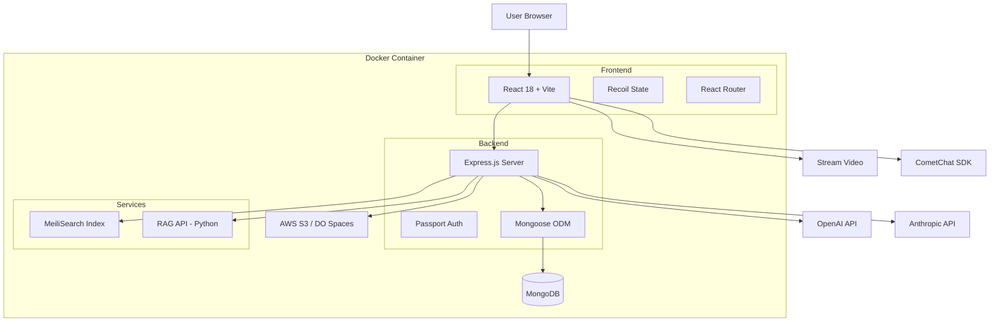

### Folder Structure (Current)

```
toolchat/
├── api/                              # Backend (Node.js/Express)
│   ├── server/
│   │   ├── index.js                 # Main server entry
│   │   ├── routes/
│   │   │   ├── auth.js              # Auth endpoints
│   │   │   ├── convos.js            # Conversations
│   │   │   ├── messages/
│   │   │   │   └── ask.js           # Chat streaming
│   │   │   ├── agents/              # Agent endpoints
│   │   │   ├── files/               # File uploads
│   │   │   └── lms/                 # Course management
│   │   ├── controllers/
│   │   │   ├── agents/v1.js         # Agent logic
│   │   │   └── messages.js          # Message handling
│   │   ├── services/
│   │   │   ├── Endpoints/
│   │   │   │   └── agents/
│   │   │   │       ├── initialize.js    # Agent setup
│   │   │   │       ├── agent.js         # Agent execution
│   │   │   │       └── run.js           # Agent runtime
│   │   │   ├── Files/               # File handling
│   │   │   ├── MemoryService.js     # Memory system
│   │   │   └── AppService.js        # App initialization
│   │   └── middleware/
│   │       ├── requireJwtAuth.js    # Auth guard
│   │       └── checkUserRole.js     # RBAC
│   ├── models/                      # Mongoose schemas
│   │   ├── User.js
│   │   ├── Conversation.js
│   │   ├── Message.js
│   │   ├── Agent.js
│   │   └── Course.js
│   └── app/                         # AI clients
│       └── clients/
│           ├── agents/              # Agent implementations
│           ├── tools/               # Tool definitions
│           └── prompts/             # Prompt templates
│
├── client/                          # Frontend (React/Vite)
│   ├── src/
│   │   ├── components/
│   │   │   ├── Chat/
│   │   │   │   ├── ChatView.tsx
│   │   │   │   ├── Messages/
│   │   │   │   │   ├── Message.tsx
│   │   │   │   │   └── MessageRender.tsx
│   │   │   │   └── Input/
│   │   │   │       └── MessageInput.tsx
│   │   │   ├── CometChat/           # Community chat
│   │   │   └── LMS/                 # Course UI
│   │   ├── hooks/
│   │   │   ├── useMessageProcess.ts
│   │   │   └── useChatContext.ts
│   │   ├── store/                   # Recoil atoms
│   │   │   ├── conversationAtom.ts
│   │   │   └── messagesAtom.ts
│   │   └── routes/
│   │       └── Chat.tsx
│   └── public/
│       └── CourseModules/           # LMS thumbnails
│
├── packages/                        # Shared monorepo packages
│   ├── data-provider/               # API client
│   ├── api/                         # Shared API types
│   └── data-schemas/                # Zod schemas
│
├── docker-compose.yml               # Container orchestration
├── Dockerfile                       # Multi-stage build
└── librechat.yaml                   # App configuration
```

### Data Flow: User Message → AI Response

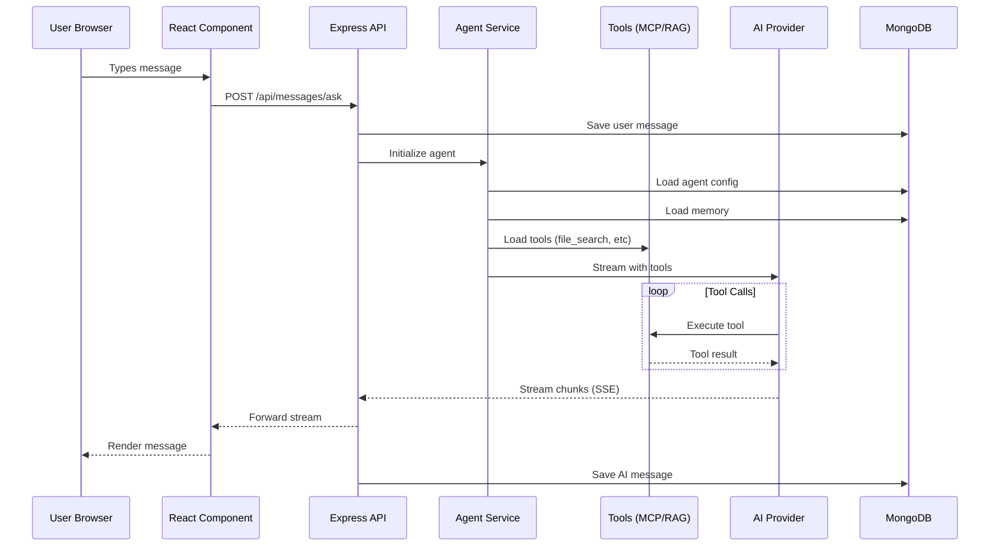

### RAG Data Flow

```mermaid
graph LR
    subgraph "File Upload"
        User[User] --> Upload[Upload PDF]
        Upload --> S3[S3 Storage]
        Upload --> MongoDB[(File Metadata)]
    end
    
    subgraph "RAG Processing"
        MongoDB --> RAG[RAG API<br/>Python/FastAPI]
        S3 --> RAG
        RAG --> Chunk[Chunk Document]
        Chunk --> Embed[Generate Embeddings<br/>OpenAI]
        Embed --> Vector[(Vector DB<br/>Chroma/Pinecone)]
    end
    
    subgraph "Query"
        Query[User Query] --> Agent[Agent]
        Agent --> FileSearch[file_search tool]
        FileSearch --> Vector
        Vector --> Results[Top K chunks]
        Results --> Agent
    end
```

### Current Database Schema (MongoDB)

```javascript
// User
{
  _id: ObjectId,
  email: String,
  tier: 'free' | 'pro',
  role: 'user' | 'admin'
}

// Conversation
{
  _id: ObjectId,
  user: ObjectId,  // Reference
  title: String,
  endpoint: String,
  agentId: String,
  model: String
}

// Message
{
  _id: ObjectId,
  conversationId: String,
  user: ObjectId,
  text: String,
  isCreatedByUser: Boolean,
  parentMessageId: String,  // For branching
  children: [String]
}

// Agent
{
  _id: ObjectId,
  id: 'agent_abc123',
  author: ObjectId,
  name: String,
  instructions: String,
  model: String,
  provider: String,
  tools: [String],
  model_parameters: Object
}
```

### Current Docker Build Pipeline

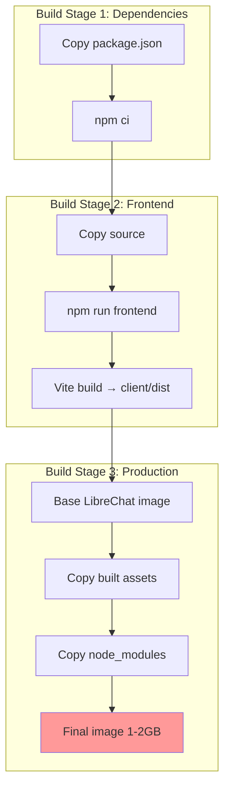

**Build Time**: 5-15 minutes  
**Image Size**: 1-2GB  
**Cold Start**: 5-10 seconds

---

## Target System Architecture (ShadFlareAi + Neon + oRPC)

### High-Level Overview

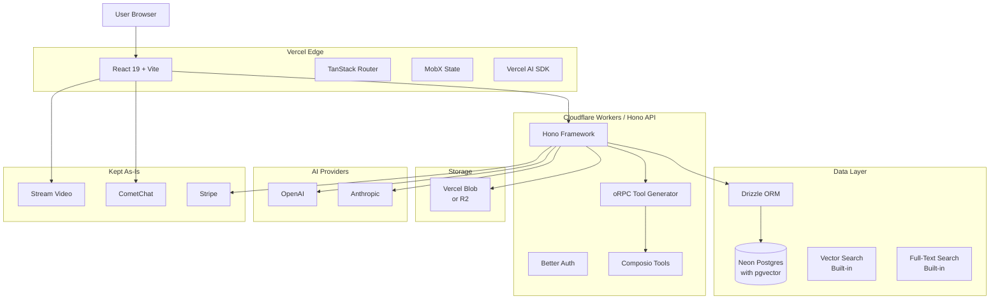

### Target Folder Structure

```
solo-os-rebuild/                     # Forked from ShadFlareAi
├── src/                             # Frontend (React 19 + TS)
│   ├── routes/                      # TanStack Router
│   │   ├── __root.tsx               # Root layout
│   │   ├── index.tsx                # Home page
│   │   ├── chat/
│   │   │   ├── index.tsx            # Chat list
│   │   │   └── $conversationId.tsx  # Chat view
│   │   └── agents/
│   │       ├── index.tsx            # Agent list
│   │       └── $agentId.tsx         # Agent detail
│   │
│   ├── components/
│   │   ├── ui/                      # Shadcn components
│   │   │   ├── button.tsx
│   │   │   ├── dialog.tsx
│   │   │   └── ...
│   │   ├── chat/
│   │   │   ├── message-list.tsx
│   │   │   ├── message-input.tsx
│   │   │   └── ai-elements/         # Vercel AI Elements
│   │   │       ├── message.tsx
│   │   │       └── response.tsx
│   │   └── agents/
│   │       └── agent-builder.tsx
│   │
│   ├── stores/                      # MobX stores
│   │   ├── chat-store.ts
│   │   ├── auth-store.ts
│   │   └── agent-store.ts
│   │
│   ├── lib/
│   │   ├── ai.ts                    # Vercel AI SDK setup
│   │   ├── api-client.ts            # API client
│   │   └── utils.ts
│   │
│   └── App.tsx
│
├── server/                          # Backend (Hono + Cloudflare Workers)
│   ├── index.ts                     # Main entry point
│   │
│   ├── routes/
│   │   ├── auth.ts                  # Auth endpoints (Better Auth)
│   │   ├── chat.ts                  # Chat API
│   │   ├── conversations.ts         # Conversation CRUD
│   │   ├── agents.ts                # Agent management
│   │   ├── tools.ts                 # Tool management (oRPC)
│   │   ├── files.ts                 # File uploads
│   │   ├── memory.ts                # Memory system
│   │   ├── rag.ts                   # RAG/vector search
│   │   └── lms.ts                   # LMS features
│   │
│   ├── middleware/
│   │   ├── auth.ts                  # Auth guard
│   │   ├── tenant.ts                # Tenant context injection
│   │   └── rate-limit.ts            # Rate limiting
│   │
│   ├── services/
│   │   ├── ai/
│   │   │   ├── agent-executor.ts    # Agent execution
│   │   │   ├── memory-injection.ts  # Memory system
│   │   │   └── tool-loader.ts       # Load tools
│   │   ├── orpc/
│   │   │   ├── generator.ts         # oRPC tool generator
│   │   │   └── registry.ts          # Tool registry
│   │   └── composio/
│   │       └── integration.ts       # Composio setup
│   │
│   └── lib/
│       ├── db.ts                    # Drizzle connection
│       └── storage.ts               # Vercel Blob client
│
├── database/                        # Drizzle schema & migrations
│   ├── schema/
│   │   ├── tenants.ts               # Multi-tenancy
│   │   ├── users.ts
│   │   ├── conversations.ts
│   │   ├── messages.ts
│   │   ├── agents.ts
│   │   ├── files.ts
│   │   ├── memories.ts
│   │   ├── document-chunks.ts       # RAG chunks with vectors
│   │   └── courses.ts               # LMS
│   │
│   ├── migrations/                  # Auto-generated
│   │   └── 0001_initial.sql
│   │
│   └── migrate.ts                   # Migration runner
│
├── functions/                       # Cloudflare Pages Functions (optional)
│   └── api/
│       └── [...routes].ts
│
└── wrangler.toml                    # Cloudflare config
```

### Data Flow: User Message → AI Response (Target)

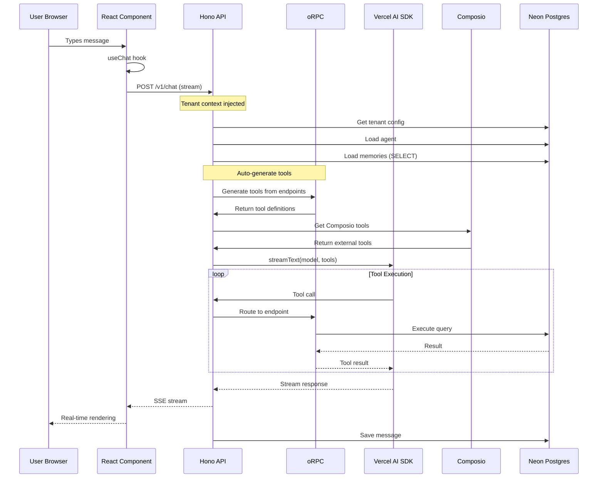

### RAG Data Flow (Target - Built-in pgvector)

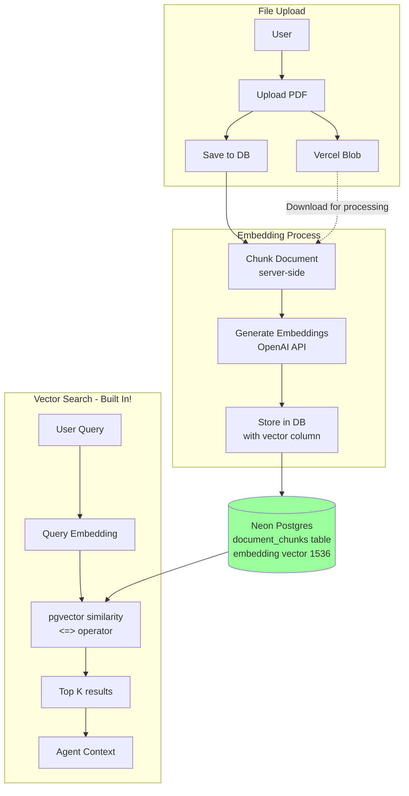

**Key Improvement**: No external RAG service needed!

### Target Database Schema (Neon Postgres + Drizzle)

```typescript
// database/schema/tenants.ts
export const tenants = pgTable('tenants', {
  id: uuid('id').primaryKey().defaultRandom(),
  name: text('name').notNull(),
  subdomain: text('subdomain').unique().notNull(),
  config: jsonb('config').$type<TenantConfig>(),
  createdAt: timestamp('created_at').defaultNow().notNull(),
});

// database/schema/users.ts
export const users = pgTable('users', {
  id: uuid('id').primaryKey().defaultRandom(),
  tenantId: uuid('tenant_id')
    .references(() => tenants.id, { onDelete: 'cascade' })
    .notNull(),
  email: text('email').notNull().unique(),
  tier: tierEnum('tier').default('free').notNull(),
  role: roleEnum('role').default('user').notNull(),
  createdAt: timestamp('created_at').defaultNow().notNull(),
});

// database/schema/conversations.ts
export const conversations = pgTable('conversations', {
  id: uuid('id').primaryKey().defaultRandom(),
  tenantId: uuid('tenant_id')
    .references(() => tenants.id)
    .notNull(),
  userId: uuid('user_id')
    .references(() => users.id)
    .notNull(),
  title: text('title'),
  agentId: text('agent_id'),
  createdAt: timestamp('created_at').defaultNow().notNull(),
});

// database/schema/messages.ts
export const messages = pgTable('messages', {
  id: uuid('id').primaryKey().defaultRandom(),
  conversationId: uuid('conversation_id')
    .references(() => conversations.id, { onDelete: 'cascade' })
    .notNull(),
  tenantId: uuid('tenant_id')
    .references(() => tenants.id)
    .notNull(),
  content: text('content').notNull(),
  role: roleEnum('role').notNull(),
  parentId: uuid('parent_id')
    .references(() => messages.id),  // For branching
  createdAt: timestamp('created_at').defaultNow().notNull(),
});

// database/schema/agents.ts
export const agents = pgTable('agents', {
  id: text('id').primaryKey(),
  tenantId: uuid('tenant_id')
    .references(() => tenants.id)
    .notNull(),
  name: text('name').notNull(),
  instructions: text('instructions').notNull(),
  model: text('model').notNull(),
  provider: text('provider').notNull(),
  tools: jsonb('tools').$type<string[]>().default([]),
  parameters: jsonb('parameters').$type<ModelParams>(),
  createdAt: timestamp('created_at').defaultNow().notNull(),
});

// database/schema/document-chunks.ts (RAG)
export const documentChunks = pgTable('document_chunks', {
  id: uuid('id').primaryKey().defaultRandom(),
  fileId: uuid('file_id')
    .references(() => files.id, { onDelete: 'cascade' })
    .notNull(),
  tenantId: uuid('tenant_id')
    .references(() => tenants.id)
    .notNull(),
  content: text('content').notNull(),
  embedding: vector('embedding', { dimensions: 1536 }),  // pgvector!
  metadata: jsonb('metadata').$type<ChunkMetadata>(),
  createdAt: timestamp('created_at').defaultNow().notNull(),
});

// Vector similarity search index
export const embeddingIndex = index('document_chunks_embedding_idx')
  .using('ivfflat', documentChunks.embedding);
```

### Key Database Improvements

| Feature | Current (MongoDB) | Target (Neon Postgres) |
|---------|-------------------|------------------------|
| **Schema** | No enforcement | Strong typing |
| **Relationships** | Manual refs | Foreign keys |
| **Queries** | Aggregation pipelines | Clean SQL |
| **Search** | External (MeiliSearch) | Built-in FTS |
| **Vectors** | External RAG API | Built-in pgvector |
| **Multi-tenancy** | Manual filtering | Row-Level Security |
| **Migrations** | Manual scripts | Drizzle migrations |

---

## oRPC Architecture

### What oRPC Does

**Automatically converts Hono endpoints → LLM tools**

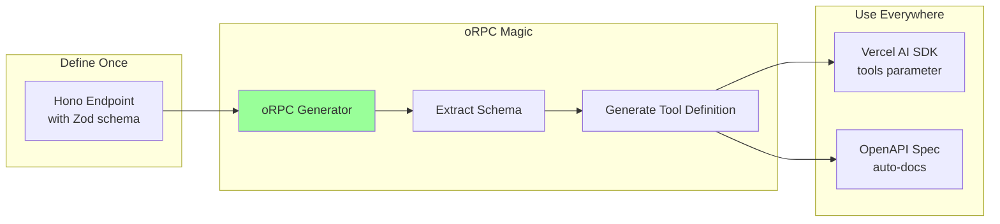

### Code Example: Before vs After

**Before (Manual - what you'd do with Composio)**:
```typescript
// 1. Define endpoint
app.post('/api/users/search', async (c) => {
  const { query } = await c.req.json();
  const users = await db.query.users.findMany({
    where: ilike(users.name, `%${query}%`)
  });
  return c.json({ users });
});

// 2. Manually define tool (50+ lines)
const searchUsersTool = {
  name: 'search_users',
  description: 'Search for users by name',
  parameters: {
    type: 'object',
    properties: {
      query: {
        type: 'string',
        description: 'Search query'
      }
    },
    required: ['query']
  },
  execute: async (params) => {
    const response = await fetch('/api/users/search', {
      method: 'POST',
      body: JSON.stringify(params)
    });
    return response.json();
  }
};

// 3. Register with AI
const tools = [searchUsersTool, /* ...more manual tools */];
```

**After (Automatic with oRPC)**:
```typescript
// 1. Define endpoint with Zod validation
import { zValidator } from '@hono/zod-validator';
import { z } from 'zod';

app.post('/api/users/search',
  zValidator('json', z.object({
    query: z.string().describe('Search query for user name')
  })),
  async (c) => {
    const { query } = c.req.valid('json');
    const users = await db.query.users.findMany({
      where: ilike(users.name, `%${query}%`)
    });
    return c.json({ users });
  }
);

// 2. Auto-generate ALL tools
import { generateTools } from '@orpc/server';

const tools = generateTools(app, {
  include: ['/api/users/*', '/api/conversations/*'],
  exclude: ['/api/auth/*']
});

// Done! Tools are automatically:
// - Type-safe (from Zod)
// - Documented (from descriptions)
// - Executable (routes to endpoint)
// - Always in sync with API
```

**Savings**: 90% less code, zero sync issues

### oRPC Integration in Server

```typescript
// server/index.ts
import { Hono } from 'hono';
import { generateTools } from '@orpc/server';
import { streamText } from 'ai';
import { openai } from '@ai-sdk/openai';

const app = new Hono();

// Define all your API endpoints normally
app.post('/api/users/search', ...);
app.post('/api/memory/add', ...);
app.post('/api/files/search', ...);
// ... 50+ more endpoints

// Auto-generate tools from endpoints
const autoGeneratedTools = generateTools(app, {
  include: [
    '/api/users/*',
    '/api/conversations/*',
    '/api/memory/*',
    '/api/files/*'
  ],
  exclude: ['/api/auth/*', '/api/admin/*']
});

// Chat endpoint uses auto-generated tools
app.post('/v1/chat', async (c) => {
  const { messages, agentId } = await c.req.json();
  
  // Load agent config
  const agent = await db.query.agents.findFirst({
    where: eq(agents.id, agentId)
  });
  
  // Filter tools for this agent
  const agentTools = autoGeneratedTools.filter(t => 
    agent.tools.includes(t.name)
  );
  
  // Stream with auto-generated tools
  const result = streamText({
    model: openai(agent.model),
    messages,
    tools: agentTools,  // All tools auto-generated!
    system: agent.instructions
  });
  
  return result.toDataStreamResponse();
});
```

---

## Composio Integration

### What Composio Provides

**Pre-built integrations for 100+ external services**

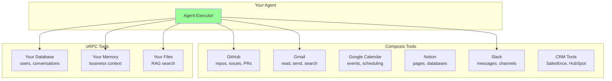

### Integration Code

```typescript
// server/services/composio/integration.ts
import { Composio } from 'composio-core';
import { openai } from '@ai-sdk/openai';

const composio = new Composio({
  apiKey: process.env.COMPOSIO_API_KEY
});

// Get available tools for a user
export async function getComposioTools(userId: string, toolIds: string[]) {
  const tools = await composio.getToolsForUser({
    userId,
    tools: toolIds,  // e.g., ['GITHUB_GET_REPO', 'GMAIL_SEND']
  });
  
  return tools;
}

// Example: Agent with both oRPC and Composio tools
export async function executeAgentWithTools(
  agentId: string,
  messages: Message[]
) {
  const agent = await db.query.agents.findFirst({
    where: eq(agents.id, agentId)
  });
  
  // Get oRPC tools (your API endpoints)
  const orpcTools = autoGeneratedTools.filter(t =>
    agent.tools.includes(t.name)
  );
  
  // Get Composio tools (external services)
  const composioToolIds = agent.tools.filter(t =>
    t.startsWith('GITHUB_') || t.startsWith('GMAIL_')
  );
  const composioTools = await getComposioTools(
    agent.userId,
    composioToolIds
  );
  
  // Combine all tools
  const allTools = [...orpcTools, ...composioTools];
  
  // Execute with Vercel AI SDK
  const result = streamText({
    model: openai(agent.model),
    messages,
    tools: allTools,  // oRPC + Composio!
    system: agent.instructions
  });
  
  return result;
}
```

### Tool Combination Strategy

```mermaid
graph LR
    subgraph "Internal Tools - oRPC"
        A1[User Search]
        A2[Memory Add]
        A3[File Search]
        A4[Conversation List]
    end
    
    subgraph "External Tools - Composio"
        B1[GitHub Create Issue]
        B2[Gmail Send Email]
        B3[Calendar Create Event]
        B4[Notion Add Page]
    end
    
    subgraph "Agent"
        Agent[Unified Tool Interface]
    end
    
    A1 --> Agent
    A2 --> Agent
    A3 --> Agent
    A4 --> Agent
    B1 --> Agent
    B2 --> Agent
    B3 --> Agent
    B4 --> Agent
    
    Agent --> Response[AI Response<br/>with tool results]
```

**Agent sees no difference** - all tools are just functions it can call!

---

## Deployment Architecture

### Current (Docker)

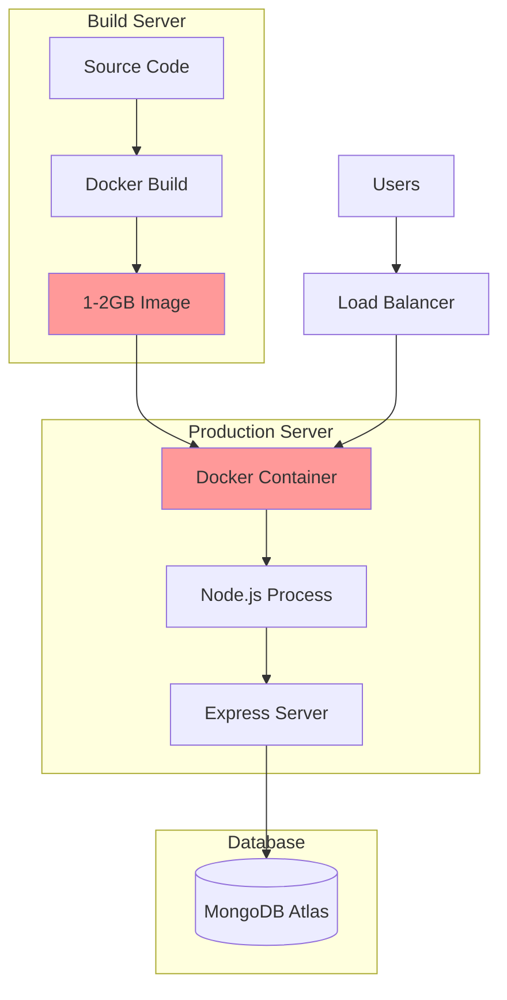

**Issues**:
- 5-15 minute builds
- 1-2GB images
- Single server scaling
- 5-10 second cold starts

### Target (Edge + Serverless)

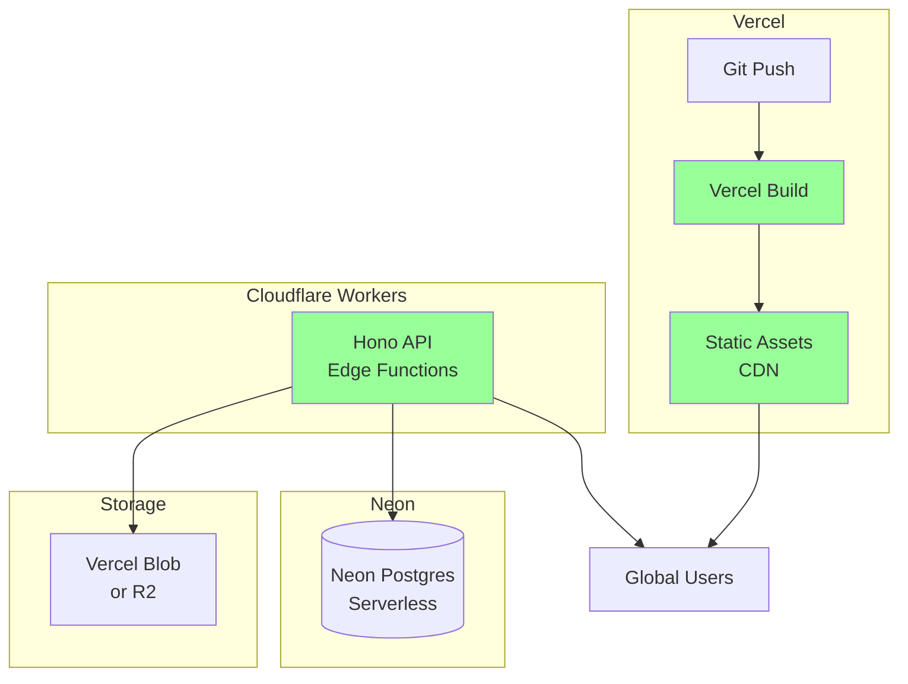

**Improvements**:
- 30-60 second builds
- Edge deployment (300+ locations)
- Auto-scaling
- <500ms cold starts
- Pay-per-use pricing

### Build Pipeline Comparison

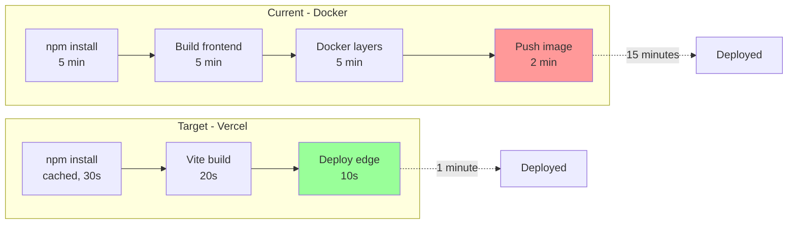

---

## Migration Architecture Pattern

### Parallel Running Strategy

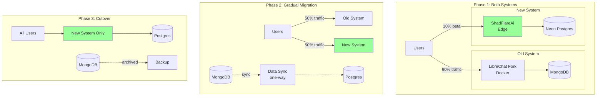

---

## Next Steps

1. **Review this architecture** - Understand data flows
2. **Fork ShadFlareAi** - Get the starter
3. **Setup Neon** - Create database
4. **Test oRPC** - Validate tool generation
5. **Build POC** - One working agent with tools

---

## Related Documentation

| Document | What It Covers | Read Next If... |
|----------|----------------|-----------------|
| **[Features](./features.md)** | Complete feature catalog with code | You want to see how features are implemented |
| **[Starter Integration](./starter-integration.md)** | Step-by-step 4-month rebuild | You're ready to start coding |
| **[Tech Stack](./tech-stack.md)** | Technology comparison and rationale | You want to understand tech decisions |
| **[Data Models](./data-models.md)** | Database schemas with examples | You're planning data layer |
| **[API Endpoints](./api-endpoints.md)** | Complete API surface documentation | You're building the API |
| **[Pain Points](./pain-points.md)** | Technical debt analysis | You need business justification |
| **[Dependencies](./dependencies.md)** | Dependency inventory and migration | You want to understand what's being replaced |

**Start here**: [Starter Integration Guide](./starter-integration.md) for actionable next steps.
